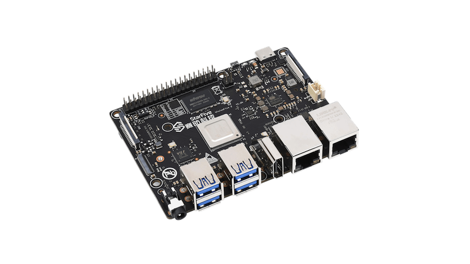

# Swift on Riscv64

### Building swift for riscv64 platforms

#### Update June 2024

- All development has now moved to `swift-5.10.1-RELEASE` and the `main-branch`. Older swift versions have proved to be too difficult and not viable to continue.
   
- Test release of `swift-5.10.1-RELEASE` for riscv64 is now available!
   
- A new project, [Patches to Upstream](https://github.com/orgs/swift-riscv/projects/2), has been set up to track upstream patches being submitted to `swift` and all the supporting projects.
   
- New riscv64 hardware is coming soon! In the coming weeks we will be receiving a new [Pioneer Box](https://milkv.io/pioneer) will hugely reduce build times and increase productivity.

### [How to setup a Developer Environment for Riscv64 using Docker](/docs/riscv64-dev-env/build-dev-environment-for-riscv64.md)

 

### [Builds running on Swift Community CI Server](https://ci.swiftlang.xyz/view/riscv64/)

Debian Sid / Unstable - Swift 5.10.1 RELEASE &nbsp;&nbsp;&nbsp;&nbsp;&nbsp;&nbsp;

 

### [Riscv64 Hardware - Visionfive 2](visionfive-2/README.md)

