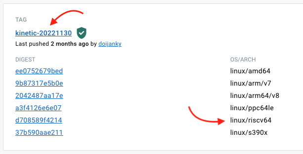

# Building a Developer Environment for Riscv64 With Docker

---

In this tutorial we learn how set up a developer environment for riscv64 using **Docker** and **QEMU**.  
All setup shown here is in a terminal and on a fresh install of **Ubuntu 22.04 Jammy**

This will include :-  
➡ Installation and setup of Docker  
➡ Installation and setup of QEMU  
➡ Creating a riscv64 Docker image  
➡ Running and Testing a riscv64 Container

---

## Step 1 - Install The Docker Engine

_* Note: We are installing the **Docker Engine** not **Docker Desktop**. *_  
For full and detailed Installation instructions please see the [Docker Docs](https://docs.docker.com/engine/install/ubuntu/)

1. Update the apt package index and install packages to allow apt to use a repository over HTTPS:

```bash
sudo apt-get update
sudo apt-get install \
    ca-certificates \
    curl \
    gnupg \
    lsb-release
```

2. Add Docker’s official GPG key:

```bash
sudo mkdir -m 0755 -p /etc/apt/keyrings
curl -fsSL https://download.docker.com/linux/ubuntu/gpg | sudo gpg --dearmor -o /etc/apt/keyrings/docker.gpg
```

3. Use the following command to set up the repository:

```bash
echo \
  "deb [arch=$(dpkg --print-architecture) signed-by=/etc/apt/keyrings/docker.gpg] https://download.docker.com/linux/ubuntu \
  $(lsb_release -cs) stable" | sudo tee /etc/apt/sources.list.d/docker.list > /dev/null
```

4. Update the apt package index:

```bash
sudo apt-get update
```

5. Install Docker Engine, containerd, and Docker Compose:

```bash
sudo apt-get install docker-ce docker-ce-cli containerd.io docker-buildx-plugin docker-compose-plugin
```

6. Verify that the Docker Engine installation is successful by running the hello-world image:

```bash
sudo docker run hello-world
```

If every went well you should see the following message

```bash
Unable to find image 'hello-world:latest' locally
latest: Pulling from library/hello-world
2db29710123e: Pull complete
Digest: sha256:6e8b6f026e0b9c419ea0fd02d3905dd0952ad1feea67543f525c73a0a790fefb
Status: Downloaded newer image for hello-world:latest

Hello from Docker!
This message shows that your installation appears to be working correctly.

To generate this message, Docker took the following steps:
 1. The Docker client contacted the Docker daemon.
 2. The Docker daemon pulled the "hello-world" image from the Docker Hub.
    (amd64)
 3. The Docker daemon created a new container from that image which runs the
    executable that produces the output you are currently reading.
 4. The Docker daemon streamed that output to the Docker client, which sent it
    to your terminal.

To try something more ambitious, you can run an Ubuntu container with:
 $ docker run -it ubuntu bash

Share images, automate workflows, and more with a free Docker ID:
 https://hub.docker.com/

For more examples and ideas, visit:
 https://docs.docker.com/get-started/

```

If you want to use **Docker** without `sudo` please refer to the [Docker Docs](https://docs.docker.com/engine/install/linux-postinstall/#manage-docker-as-a-non-root-user)

---

## Setting up QEMU for Docker

Docker images can support multiple platforms for a variety of different architectures.  
For details instructions on **Multi-platform Images** please refer to the [Docker Docs](https://docs.docker.com/build/building/multi-platform/)

To set up docker for multi-platforms we will need to use the **BuildX Builder**  
To see the currently available platforms run the following command -

```bash
docker buildx ls

NAME/NODE DRIVER/ENDPOINT STATUS  BUILDKIT PLATFORMS
default * docker
  default default         running 23.0.1   linux/amd64, linux/amd64/v2, linux/amd64/v3, linux/amd64/v4, linux/386
```

This will normally only show platforms supported by the host architecture.  
To active other platforms including `riscv64` we will need to run the following command -

```bash
docker run --privileged --rm tonistiigi/binfmt --install all
```

If we run buildx ls again we will see we now have many new platforms avaialbe, including `rscv64`

```bash
docker buildx ls
NAME/NODE DRIVER/ENDPOINT STATUS  BUILDKIT PLATFORMS
default * docker
  default default         running 23.0.1   linux/amd64, linux/amd64/v2, linux/amd64/v3, linux/amd64/v4, linux/386, linux/arm64, linux/riscv64, linux/ppc64le, linux/s390x, linux/mips64le, linux/mips64, linux/arm/v7, linux/arm/v6
```

---

## Adding a Docker Buildx Builder

To build and use a `riscv64` image first we need to create a buildx builder.

1. Create Buildx Builder named `riscv64-builder`

```bash
docker buildx create --name riscv64-builder --driver docker-container --bootstrap
```

2. Using the new builder

```bash
docker buildx use riscv64-builder
```

When we run `docker buildx ls` we will now see the new builder is selected.

```bash
docker buildx ls
NAME/NODE          DRIVER/ENDPOINT             STATUS  BUILDKIT PLATFORMS
riscv64-builder *  docker-container
  riscv64-builder0 unix:///var/run/docker.sock running v0.11.3  linux/amd64, linux/amd64/v2, linux/amd64/v3, linux/amd64/v4, linux/arm64, linux/riscv64, linux/ppc64le, linux/s390x, linux/386, linux/mips64le, linux/mips64, linux/arm/v7, linux/arm/v6
default            docker
  default          default                     running 23.0.1   linux/amd64, linux/amd64/v2, linux/amd64/v3, linux/amd64/v4, linux/386, linux/arm64, linux/riscv64, linux/ppc64le, linux/s390x, linux/mips64le, linux/mips64, linux/arm/v7, linux/arm/v6
```

---

## Using a riscv64 Docker Image

To use a `riscv64` image all we need to do is specify the `platform` in the docker run command.  
When selecting an image on [Docker Hub](https://hub.docker.com/) make sure that the image supports the `linux/riscv64` platform.  
Under `OS/ARCH` it should list `riscv64`.



The best place for riscv64 images is [riscv64](https://hub.docker.com/u/riscv64). They have images for many distributions such as `Debian`, `Ubuntu`, etc. In this example we will use the `debian unstable` image to get access to the latest riscv64 packages.

To create and run a riscv64 container add `--platform linux/riscv64` to the `run` command -

```bash
docker run --platform=linux/riscv64 -it riscv64/debian:unstable
```

Run `uname -m` in the new container and it should return `riscv64`

```bash
root@85fe1308a50e:/ uname -m
riscv64
```

---

## Creating a custom riscv64 Docker Image

To build a `riscv64` docker image we just need to add the platform to `FROM` in the Dockerfile.

```javascript

FROM --platform=linux/riscv64 riscv64/debian:unstable

```

---

Congratulations, you now have a `riscv64` developer environment!
