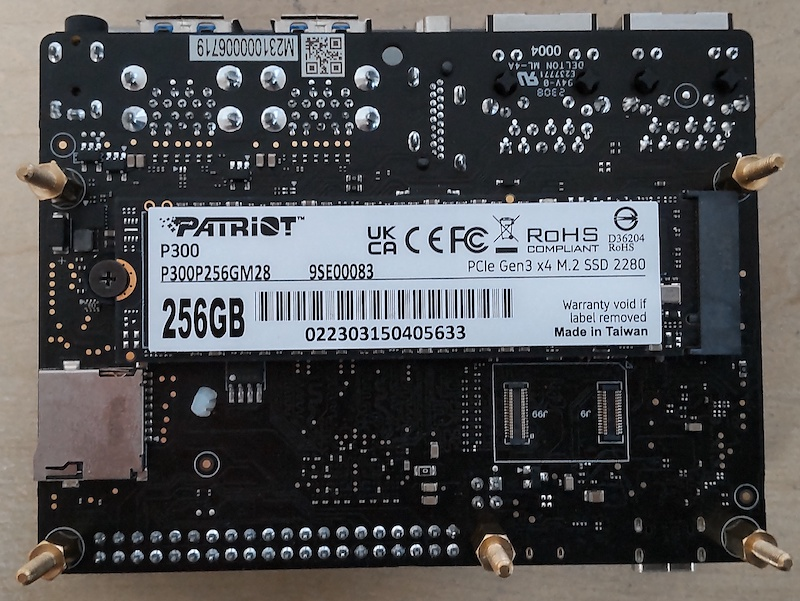
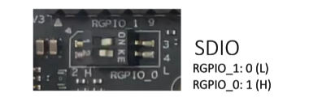
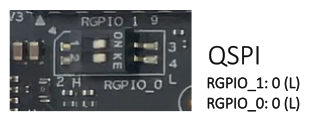

# Boot From NVME SSD

Note 1: This method currently only works with the latest `starfive visionfive2` image.  
Note 2: Firmware must be updated to version 3.0.4

### Download Files

Download the following files to your PC.
From [VF2_v3.0.4](https://github.com/starfive-tech/VisionFive2/releases/tag/VF2_v3.0.4)  
`sdcard.img`  
`u-boot-spl.bin.normal.out`  
`visionfive2_fw_payload.img`

From [VisionFive2](https://drive.google.com/drive/folders/1cctIVdCfbPhKpyQ0PcmCQ92KCQjJ8JI5)  
`starfive-jh7110-VF2-SD-wayland.img`

### Load img to SD Card

Use Etcher or similar software to load the `sdcard.img` onto an sd card.

### Install NVME to Board

Install the NVME drive to the board.



### First Boot

Set the `boot mode` to the SDIO by setting the boot switches as in the image below.



Insert the sdcard and power on the board.

After the board has booted from sd card login via ssh.  
user = `root`  
password = `starfive`

### Update Firmware

_If you have already updated the firmware skip to the next step._

Open a terminal on your PC and copy the following files to the board.

```bash
# note: use your visionfive2 board ip address
scp u-boot-spl.bin.normal.out root@192.168.*.*:u-boot-spl.bin.normal.out
scp visionfive2_fw_payload.img root@192.168.*.*:visionfive2_fw_payload.img
```

On the visionfive2 board run the following commands to update the firmware.

```bash
flashcp -v u-boot-spl.bin.normal.out /dev/mtd0
flashcp -v visionfive2_fw_payload.img /dev/mtd1
```

### Prepare NVME Drive

Open a terminal on your PC and copy the OS image file to the board

```bash
# note: use your visionfive2 board ip address
scp starfive-jh7110-VF2-SD-wayland.img root@192.168.*.*:starfive-jh7110-VF2-SD-wayland.img
```

On the visionfive2 board run the following commands to copy the image to the nvme drive.

```sh
dd if=starfive-jh7110-VF2-SD-wayland.img of=/dev/nvme0n1 bs=4M
```

Change drive information in extlinux.conf and fstab to match the nvme drive.

```sh
mkdir nvme-boot && mount /dev/nvme0n1p3 nvme-boot
sed -i 's/mmcblk1p3/nvme0n1p3/g' nvme-boot/extlinux/extlinux.conf
sed -i 's/mmcblk1p4/nvme0n1p4/g' nvme-boot/extlinux/extlinux.conf
umount nvme-boot
mkdir nvme-root && mount /dev/nvme0n1p4 nvme-root
sed -i 's/mmcblk1p3/nvme0n1p3/g' nvme-root/etc/fstab
sed -i 's/mmcblk1p4/nvme0n1p4/g' nvme-root/etc/fstab
umount nvme-root
```

### Power off and set bootmode

Power off the board

```bash
poweroff
```

Remove the sdcard

Set the boot mode to QSPI to allow boot from NVME.  


### Boot from NVME

Power on the board and it should now boot and run from the NVME drive.

After logging in there are 2 more things to do.

1 - [Resize nvme Partition](https://doc-en.rvspace.org/VisionFive2/Quick_Start_Guide/VisionFive2_QSG/extend_partition.html)

2 - Fix the sources.list

```sh
# fix sources.list
nano /etc/apt/sources.list
# comment out deb https://snapshot.debian.org/archive/debian-ports/20221225T084846Z unstable main
# add - deb https://deb.debian.org/debian-ports/ unstable main contrib non-free
```

Note: The repository is `debian-ports` not `debian`
The sources.list should look like this

```bash
cat /etc/apt/sources.list

#deb https://snapshot.debian.org/archive/debian-ports/20221225T084846Z unstable main
deb https://deb.debian.org/debian-ports/ unstable main contrib non-free
```

```sh
# update keys
wget https://deb.debian.org/debian/pool/main/d/debian-ports-archive-keyring/debian-ports-archive-keyring_2023.02.01_all.deb
dpkg -i debian-ports-archive-keyring_2023.02.01_all.deb
```

```bash
apt update
apt upgrade
```
